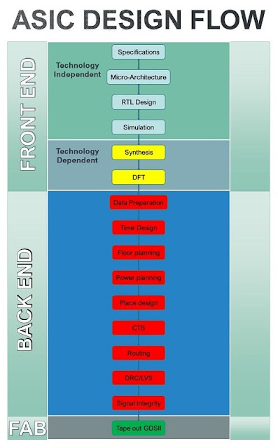
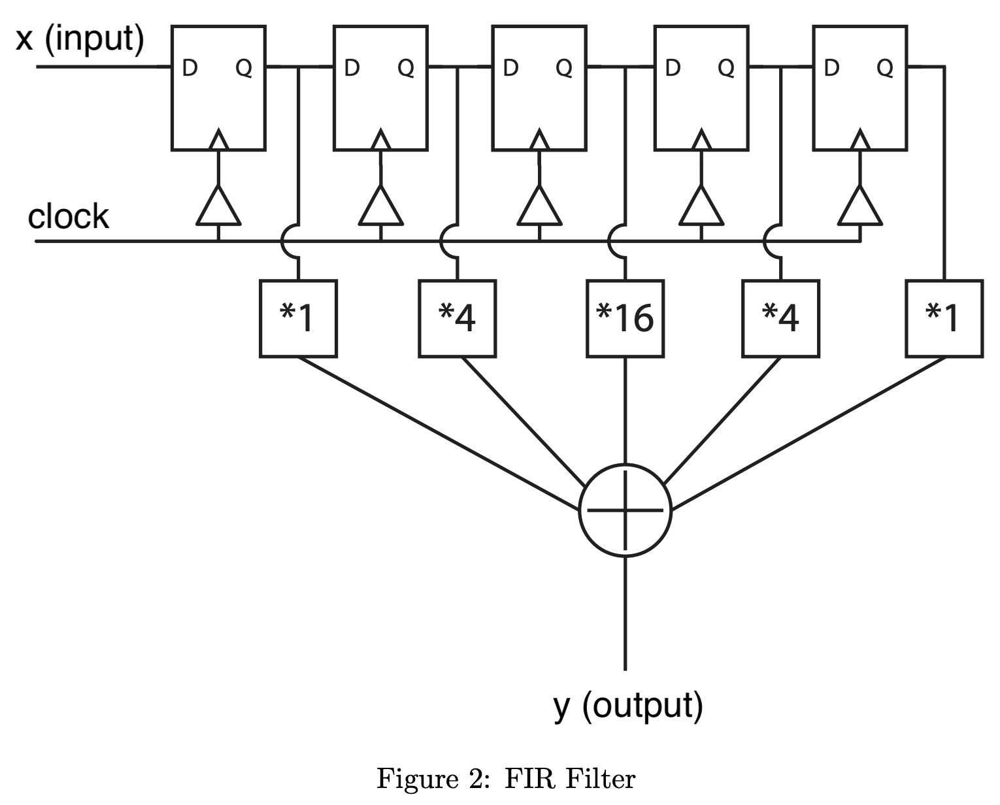

# ASIC Lab 2: Simulation
<p align="center">
Prof. John Wawrzynek
</p>
<p align="center">
TA: Kevin He, Kevin Anderson
</p>
<p align="center">
Department of Electrical Engineering and Computer Science
</p>
<p align="center">
College of Engineering, University of California, Berkeley
</p>


## Table of contents
- [ASIC Lab 2: Simulation](#asic-lab-2-simulation)
  - [Table of contents](#table-of-contents)
  - [Overview](#overview)
  - [Setup](#setup)
  - [ASIC Design Flow](#asic-design-flow)
    - [CAD Tools](#cad-tools)
    - [Hammer](#hammer)
  - [Skywater 130](#skywater-130)
  - [Testbenches](#testbenches)
  - [Waveforms](#waveforms)
  - [RTL Simulation](#rtl-simulation)
    - [Simulate the Filter](#simulate-the-filter)
    - [View Waveform](#view-waveform)
  - [Gate Level Simulation](#gate-level-simulation)
    - [Compare Behavorial and Gate Level Simulations](#compare-behavorial-and-gate-level-simulations)
    - [Standard Delay Format (SDF)](#standard-delay-format-sdf)
  - [Power Analysis](#power-analysis)
  - [Questions](#questions)
    - [Question 1: Verilog, Waveforms, and Schematics](#question-1-verilog-waveforms-and-schematics)
    - [Question 2: Understand Testbenches](#question-2-understand-testbenches)
    - [Question 3: Writing a testbench](#question-3-writing-a-testbench)
    - [Question 4: Evaluate Gate Level Simulations](#question-4-evaluate-gate-level-simulations)
    - [Question 5: SDF and Visualization of Setup Time Violations](#question-5-sdf-and-visualization-of-setup-time-violations)
    - [Question 6: Fixing hold times](#question-6-fixing-hold-times)
    - [Question 7: Analyzing Power Reports](#question-7-analyzing-power-reports)
  - [Acknowledgement](#acknowledgement)

## Overview

**Objective:** 
Simulation is a fundamental step in ASIC design and digital design in general. Different forms of simulation can happen at several stages in the design cycle, however the main two are ***behavorial*** (also called ***RTL simulation***) and ***gate-level***. In this lab, you will be introduced to both using industry tools from [Cadence](https://en.wikipedia.org/wiki/Cadence_Design_Systems). CAD tools have a steep learning curve. To ease the learning experience, we interact with the CAD tools using Hammer; a tool generated at Berkeley to simplify interaction with the ASIC design ECAD tools.

**Topics Covered**
- CAD Tools (emphasis on *VCS* and *DVE*)
- Hammer
- Skywater 130mm PDK
- Behavorial RTL Simulation
- Gate Level Simulation
- Simple Power Analysis

**Recommended Reading**
- [Verilog Primer](https://inst.eecs.berkeley.edu/~eecs151/fa21/files/verilog/Verilog_Primer_Slides.pdf)

<span style="color:red"> ***WARNING:*** **Under no circumstance should any third party information, manuals be copied from the instructional servers to personal devices. In addition, do not copy plugins from hammer that interact with third party tools to a personal device.**</span>


## Setup


Prior to running any commmands you need to activate a Python 3.11 virtual environment with a Hammer (hammer-vlsi) installation and setup environment variables for the CAD tools licenses. Complete the following steps:

1. Accept the [new Github Classroom](https://inst.eecs.berkeley.edu/~eecs151/fa21/files/verilog/Verilog_Primer_Slides.pdf) assignment
2. Clone your Github Classroom repo
   ```
   cd /home/tmp/<your-eecs-username>
   git clone git@github.com:EECS151-sp24/asic-labs-(GitHub username).git
   ```
   The git clone link is also available in the box labeled *Quick setup — if you’ve done this kind of thing before* in Github
3. Add the staff skeleton as a remote
   ```
   git remote add skeleton https://github.com/EECS150/asic-labs-sp24.git
   ```
4. Pull from the staff skeleton and push to your Github Classroom repo
   ```
   git pull skeleton main
   git push -u origin main
   ```
5. Source the course `.bashrc`
   ```
   source /home/ff/eecs151/asic/eecs151.bashrc
   ``` 
6. Verify Hammer was installed by running the following:
    ``` 
    hammer-vlsi -h 
    ```
    The output should be 

    ```
    usage: hammer-vlsi [-h] [-e ENVIRONMENT_CONFIG] [-p CONFIGS] [-l LOG]
                    [--obj_dir OBJ_DIR] [--syn_rundir SYN_RUNDIR]
                    [--par_rundir PAR_RUNDIR] [--drc_rundir DRC_RUNDIR]
                    [--lvs_rundir LVS_RUNDIR] [--sim_rundir SIM_RUNDIR]
                    ...
    ```
7. Verify environment variables for CAD tools are setup correctly:
    ```
    echo $CALIBRE_HOME
    ```
    The output should be: 
    ```
    /share/instsww/mgc/calibre2017/aoi_cal_2017.4_19.14
    ```

## ASIC Design Flow
A high-level digital design flow chart was shown. Here is a more detailed flow chart specifically for an ASIC design flow.

<!-- ASIC Design Flow image -->
<figure align="center">
  
  <figcaption>Image borrowed from: https://www.vlsiuniverse.com/complete-asic-design-flow/</figcaption>
</figure>


This flow chart shows many of the individual stages digital designers follow in industry. However, it does not show the cyclical nature between individual stages. For example, a bug discovered in *Simulation* provoke *RTL Design* modifications. In general, problems discovered in the backend sometimes require changes in the frontend. Therefore, it is imperative that you are well-versed in the mechanics of simulating your designs before even designing anything!

The principal stages to pay attention are: *RTL Design*, *Synthesis*, *Place design*, and *Routing* (the last two stages are often combined and termed *Place and Route*).


### CAD Tools
Going through the design flow is quite labor intensive and intricate. In general, computer-aided design (CAD) software tools refer to programs used to reduce the burden of manually performing each stage of a design flow. Electronic design automation (EDA), or electronic computer-aided design (ECAD), tools are specifically created to aid in integrated circuit design flows. 

The three major CAD companies for ASIC design are: *Cadence*, *Synopsys*, and *Siemens*. Each of these companies supplies tools for all stages of the Very Large-Scale Integration (VLSI) flow (VLSI refers to complex ICs with thousands or more trasistors).


<style type="text/css">
.tg  {border-collapse:collapse;border-spacing:0;}
.tg td{border-color:black;border-style:solid;border-width:1px;font-family:Arial, sans-serif;font-size:14px;
  overflow:hidden;padding:10px 5px;word-break:normal;}
.tg th{border-color:black;border-style:solid;border-width:1px;font-family:Arial, sans-serif;font-size:14px;
  font-weight:normal;overflow:hidden;padding:10px 5px;word-break:normal;}
.tg .tg-c3ow{border-color:inherit;text-align:center;vertical-align:top}
</style>
<table class="tg", align="center">
<thead>
  <tr>
    <th class="tg-c3ow"></th>
    <th class="tg-c3ow">Synopsys</th>
    <th class="tg-c3ow">Cadence</th>
    <th class="tg-c3ow">Siemens</th>
  </tr>
</thead>
<tbody>
  <tr>
    <td class="tg-c3ow">Simulation</td>
    <td class="tg-c3ow"><span style="font-style:italic">VCS</span></td>
    <td class="tg-c3ow"><span style="font-style:italic">Xcelium Logic Simulator</span></td>
    <td class="tg-c3ow"><span style="font-style:italic">-</span></td>
  </tr>
  <tr>
    <td class="tg-c3ow">Synthesis</td>
    <td class="tg-c3ow"><span style="font-style:italic">FusionCompiler (Design Complier)</span></td>
    <td class="tg-c3ow"><span style="font-style:italic">Genus</span></td>
    <td class="tg-c3ow"><span style="font-style:italic">-</span></td>
  </tr>
  <tr>
    <td class="tg-c3ow">Place and Route</td>
    <td class="tg-c3ow"><span style="font-style:italic">FusionCompiler (IC Compiler II)</span></td>
    <td class="tg-c3ow"><span style="font-style:italic">Innovus</span></td>
    <td class="tg-c3ow"><span style="font-style:italic">-</span></td>
  </tr>
  <tr>
    <td class="tg-c3ow">Physical Layout</td>
    <td class="tg-c3ow"><span style="font-style:italic">Custom Compiler </span></td>
    <td class="tg-c3ow"><span style="font-style:italic">Virtuoso Layout Suite</span></td>
    <td class="tg-c3ow"><span style="font-style:italic">L-Edit</span></td>
  </tr>
  <tr>
    <td class="tg-c3ow">DRC and LVS</td>
    <td class="tg-c3ow"><span style="font-style:italic">IC Validator</span></td>
    <td class="tg-c3ow"><span style="font-style:italic">Virtuoso Layout Suite</span></td>
    <td class="tg-c3ow"><span style="font-style:italic">Calibre</span></td>
  </tr>
  <tr>
    <td class="tg-c3ow">Verification and Signoff</td>
    <td class="tg-c3ow"><span style="font-style:italic">NanoTime</span></td>
    <td class="tg-c3ow"><span style="font-style:italic">Virtuoso Layout Suite</span></td>
    <td class="tg-c3ow"><span style="font-style:italic">Calibre</span></td>
  </tr>
  <tr>
    <td class="tg-c3ow">Power</td>
    <td class="tg-c3ow"><span style="font-style:italic">Prime Power</span></td>
    <td class="tg-c3ow"><span style="font-style:italic">Voltus</span></td>
    <td class="tg-c3ow"><span style="font-style:italic">-</span></td>
  </tr>
</tbody>
</table>

It is common to utilize different tools for different stages of the design flow. This is possble because the tools typically can write out to common interchange file formats that can be consumed by other vendors’ tools, or they provide utilities such that files can be converted to different formats. For example, a design may use Synopsys *VCS* for simulation, Cadence *Genus* and *Innovus* for synthesis and place-and-route, respectively, and Mentor *Calibre* for DRC and LVS. We will gain experience using some of these tools in subsequent labs.

### Hammer
In this course we will use an ASIC design framework developed here at Berkeley called Hammer. Hammer abstracts away tool- (Cadence, Synopsys, Mentor, etc.) and technology- (TSMC, Intel, etc.) specific considerations away from ASIC design. The philosophy of Hammer aims to maximize reusability of design intent between projects that may have differently underlying tool infrastructures and target different process technologies. Documentation about Hammer philosophy and usage is at Hammer [website](hammer-vlsi.readthedocs.io).

Hammer consumes serialized configuration files in YAML or JSON format, which are used as intermediate representation (IR) languages between higher-level physical design generators and the underlying scripts that the ASIC design flow tools require. In this lab repository, you will see a set of YAML files (*inst-env.yaml*, *sky130.yml*, *design.yml*, and a few *sim-\<type\>.yml*) that contain Hammer IR for our design implementation. Of these files, you will only interact with the *sim-\<type\>.yml* files to configure your simulation flow in this lab. The sources for this lab are contained in the src folder, and some special non-Verilog files will be explained later.

> **Note:** The version of Hammer used in this course may deviate from public or "main" Hammer. Please reference the public [repository](https://github.com/ucb-bar/hammer) if you are interested in the latest, consistent source.

## Skywater 130

[Skywater 130](https://skywater-pdk.readthedocs.io/en/main/), or SKY130, is an open source product development kit (PDK) for a 130nm node. This is the PDK we will use for this lab. Right now, the details of the PDK are unnecessary as you will gain familiarity in future labs. All major companies like Intel, Global Foundaries or TSMC have their own PDKs.

"*A PDK is a set of files used within the semiconductor industry to model a fabrication process for the design tools used to design an integrated circuit.  PDK’s are often specific to a foundry, and may be subject to a non-disclosure agreement.  While most PDK’s are proprietary to a foundry, certain PDKs are opensource and entirely within the public domain.*" (definition borrowed from https://blink.ucsd.edu/sponsor/exportcontrol/pdkguidance.html).


## Testbenches

A testbenches is a HDL module used in simulation only which instantiates the design-under-test (DUT), driving the inputs and verifying outputs. The provided testbench`fir_tb.v` file in the `src/` subdirectory is an example of a simple testbench. 

This testbench highlights some critical aspects of creating a testbench. First, simulating a clock: 

```verilog
reg clk;

initial clk = 1'b0;
always #(`CLOCK_PERIOD/2) clk <= ~clk;
```

The code above creates a signal named `clk` with `CLOCK_PERIOD` period that is which is initially `1'b0`. `CLOCK_PERIOD` is a define that is defined in the
`sim.inputs.defines` key in `sim-rtl.yml`. 


Secondly, most testbenches include an initial block which performs some sequence of operation (typically, driving inputs, checking outputs). Let us look at a snippet:

```verilog
initial begin
  $vcdpluson;
  In <= 4'd0;
  @(negedge clk) In<= 4'd1;
  @(negedge clk) In<= 4'd0;
  .
  .
  .
  @(negedge clk) In<= 4'd13;
  @(negedge clk) In<= 4'd14;
  @(negedge clk) In<= 4'd15;
  $vcdplusoff;
  $finish;
end
```

The first thing to notice are the system tasks: `$vcdpluson`, `$vcdplusoff`, and `$finish` (all system tasks begin with `$`).

- `$vcdpluson` and `$vcdplusoff` starts and end the vpd (waveform format) file generation 
- `$finish` ends the simulation

The remaining lines drive the register `In` with different values on the negative edge of the simulated clock. In this block, the lines are executed sequential because`@(negedge clk)` call waits until the next negative edge of the clock before executing the code on its line.

Simulators support file accesses, specifically reading and writing files. The other testbench `src/fir_tb_file.v` contains examples of reading a file. Below is a snippet from `fir_tb_file.v` showing where the register `In` is driven with the values from *input.txt* and DUT outputs are verified with values from *data_b.txt*.

```verilog
initial begin
  $vcdpluson;
  repeat (26) @(negedge clk);
  $vcdplusoff;
$finish;

end

initial begin
    $readmemb("../../src/data_b.txt", Out_correct_array);
    $readmemb("../../src/input.txt", input_array);
end

assign Out_correct = Out_correct_array[index_counter];
assign In = input_array[index_counter];

always @(negedge clk) begin
    $display($time, ": Out should be %d, got %d", Out_correct, Out);
    index_counter <= index_counter + 1;
end
```

In this snippet we use two more system tasks:

- `$readmemb` reads a byte file into a Verilog array
- `$display` writes the output string to the console (terminal or GUI console)

As you can see, system tasks are useful. We do not cover all systems tasks, but it is worth investigating others (look at the Verilog [specification](https://www.eg.bucknell.edu/~csci320/2016-fall/wp-content/uploads/2015/08/verilog-std-1364-2005.pdf)).


## Waveforms

A waveform is a file created during simulation which logs marked signals to viewed as traces for visualization post simulation. All signals or user selected signals can be marked for recording during simulation. **All desired signals must be marked prior to running a simulation. You can not mark a signal for the waverform, *after* the simulation has been run.** Waveforms are the primary method for digital designers to debug RTL. Logic for debugging RTL should be as follows: 
1. Look for obvious bugs in RTL
2. If bug is not obvious, look at the waveform


## RTL Simulation

RTL simulation is one of the first steps towards checking the functionality, or behavior of your RTL design. Fixing bugs at the RTL design phase makes subsequent debugging much easier. The resources required and runtime is much lower than gate level simulation.

For this lab, we will simulate a [FIR](https://en.wikipedia.org/wiki/Finite_impulse_response) (Finite Impulse Response) filter Verilog module. A schematic of the filter is shown below.

<figure align="center">
  
</figure>


There is an input signal and a clock input, and 5 delayed versions of the input are kept, multiplied by different coefficients, and then summed together. The expression for this particular filter is:

```
y[n] = 1 * x[n] + 4 * x[n − 1] + 16 * x[n − 2] + 4 * x[n − 3] + 1 * x[n − 4]
```
The input in our example is a 4-bit signed number and the output is a larger bitwidth signed number to ensure that there is no overflow. The focus of this lab is not the filter design itself, but it serves as a useful example of a digital circuit to implement and test with Verilog code. Verilog code for this FIR filter is provided in the `src` subdirectory.

### Simulate the Filter

You've been introduced to everything you need to run a simulation. Now it's time to run a sim! A common method of testing module is with unit test, testing the functionality of a single module and not the entire system. Here you will unit test the FIR filter. Change to the `skel` directory and run the following command:

```
make sim-rtl
```

### View Waveform

After completing the simulation, VCS dumps the waveforms to a file: `build/sim-rundir/vcdplus.vpd`. In this course, we use Discovery Visualization Environment (DVE) to view our waveforms. It has a GUI so use X2go to remote into the server. 

```shell
cd build/sim-rundir
dve -vpd vcdplus.vpd &
```

When DVE pops up, you should see the window below. There are four main panes:

1. The *Hierarchy* pane on the far left list the design hierarchy. All modules that simulated starting with the testbench and a child modules instantiated.
2. The *Data* pane to right of the *Hierarchy* pane lists all signals that were marked and record during simulation that are now viewable in a waveform window.
3. The *Editor* is the far right pane. Double clicking any module in the module *Hierarchy* pane will bring up the source code in the *Editor* pane. You can select individual signals and choose specific actions.
4. The *Console* pane is at bottom which has different windows, most importantly the *Log* window. You can also enter DVE or UCLI commands here

<p align="center">

</p>


An important feature to note is the timescale which is located right above the *Hierarhcy* pane. In the figure, it is the textfield and next t dropdown that says "x10ps". This timescale the units of time that the signals are plotted on in the waveform. Change this to be in units of nanoseconds.

Let's create a waveform. 

1. Select the `fir_tb` in the *Hierarchy* pane
2. Select the In, Out and clk signals in the *Data* pane 
3. Right click the selection, and click "Add To Waves", then “New Wave View” in the dropdown


<p align="center">

</p>
<!--  -->

A screenshot of how the waveform window should looks is shown below.
After the window opens, you may need to adjust the zoom settings from "View — Zoom" or the corresponding buttons on the toolbar. The picture below displays the output of the FIR filter as a step waveform. 

A commonly used feature is changing the radix of a given signal for easier interpretation. Change the radix of the Out signal to be 2’s complement:

1. Right-click the Out signal
2. Select "Set Radix" from the dropdown
3. Select "Twos complement"

Another commonly used feature is display the digital signal in an analog view. Change the view of the Out signal to analog:

1. Right-click the Out signal
2. Select "Set Draw Style Scheme" from the dropdown
3. Select "Analog"
     
The scale might look off since the signal does not reach full scale values. Let's fix that by changing the properties:

1. Right-click the Out signal
2. Select "Properties" from the dropdown
3. Set the Analog Waveform properties to be User, and set the Min to be -32 and the max to be 32. 

Your waveform should now be a replication of the one shown below. 

<p align="center">

</p>

Another common feature is changing the color of the signals. We will not do that here, but it important to know the simulators will automatically color signals based upon taken values:

<style type="text/css" algin="center">
.tg  {border-collapse:collapse;border-spacing:0;}
.tg td{border-color:black;border-style:solid;border-width:1px;font-family:Arial, sans-serif;font-size:14px;
  overflow:hidden;padding:10px 5px;word-break:normal;}
.tg th{border-color:black;border-style:solid;border-width:1px;font-family:Arial, sans-serif;font-size:14px;
  font-weight:normal;overflow:hidden;padding:10px 5px;word-break:normal;}
.tg .tg-c3ow{border-color:inherit;text-align:center;vertical-align:top}
</style>
<table class="tg">
<thead>
  <tr>
    <th class="tg-c3ow">Color</th>
    <th class="tg-c3ow">Meaning</th>
  </tr>
</thead>
<tbody>
  <tr>
    <td class="tg-c3ow">Green</td>
    <td class="tg-c3ow">Signal has a valid value for the type</td>
  </tr>
  <tr>
    <td class="tg-c3ow">Red</td>
    <td class="tg-c3ow">Meaning the signal is invalid. Annotated as `X`</td>
  </tr>
  <tr>
    <td class="tg-c3ow">Blue</td>
    <td class="tg-c3ow">This signal is floating, high impedance, or not being driven. You may see this at the beginning of the simulation before the registers in the filter have known values. Once they get a known value, the lines turn green. Aannotated as `Z`</td>
  </tr>
</tbody>
</table>


> **TODO:**  
> 1. Rename the vpd file from `vcdplus.vpd` to `vcdplus_orig.vpd`. 
> 2. Run a simulation using `fir_tb_file.v` testbench. Replace `fir_tb.v` with `fir_tb_file.v` under the `input_files` key in `sim-rtl.yml`. Next, change the value for the key `tb_name` to `fir_tb_file`. Finally, run `make sim-rtl` again.  


## Gate Level Simulation 

Gate level simulation is performed after a design has been synthesized. For brief context, synthesis transforms your Verilog behavorial representation into digital logic gates, or cells, from a given library (PDK) to form a *netlist* (synthesis is covered in depth in future labs). Therefore, simulating post-synthesis is simulating the design at the gate level. You will now perform a gate level simulation on the synthesized FIR filter design provided `skel/src/post-syn/fir.mapped.v`.

> **Note:** Gate level simulation is also called post-synthesis simulation

To simulate using the gate-level netlist, you simply need to make a few changes to the input YAML to Hammer. Take a look at `sim-gl-syn.yml`. You will notice that a few things have been added, including:
- a `level: "gl"` option
- a `timing_annotated: true` option
- two JSON files
- a Standard Delay Format (SDF) file

Hammer consumes the two JSON files in order to generate a Unified Command-Line Interface (UCLI) script that tells VCS to force the synthesized flip-flops into a valid initial state before starting the simulation. This is required because Verilog simulators cannot simulate with unknown ’X’ valued inputs. 

> **Note:** The SDF file is an output from the synthesis tool that annotates delays according to the synthesized gates.

> **Note:** Under the hood, Hammer has already included the Verilog models of the standard cells from the Sky130 PDK. You will learn more about these standard cells in the next lab, but just know that they are required because the gate-level circuit contains instances of the technology’s standard cells, and *VCS* must know the Verilog definition of those cells. The extra options in the new *VCS* section of the Makefile are simply to deal with these standard cell models.

Now, change directories to the `skel` subdirectory and run the make command below:

```shell
make sim-rtl SIM_RTL_CONF=sim-gl-syn.yml
```

This make command is for the same target, however in this invocation we are overriding the `SIM_RTL_CONF` Makefile variable from the command line. This points to the YAML written specifically for a gate-level simulation. Reload the waveforms after it is finished. 

> **Note:** overriding Makefile variable on the commmand line during invocation is common and is extensively used when utilizing Hammer.


### Compare Behavorial and Gate Level Simulations

Why should you simulation pre and post-synthesis is the logic does not change? Timing. 

Open both waveforms (the one from RTL simulation and the other from gate level simulation), or screenshoot one and open the other in DVE. Notice that the waveforms look similar, but not exactly the same. Let’s see why.

By default, the logic gates behave ideally. In this context, "ideally" means the output is valid *instantly* when a new input is presented. Depending on the operating conditions of the chip (voltage, process variation, temperature), the delay through a gate will be different. CAD tools calculate the delay for you, and annotate the delay onto the gates using an SDF file like the one you just saw. 

Gate-level simulations are annotated with timing information so signal propogation matters. In other words, gate output *does not change instantly* with a new input, the signal must propogate through the gate. This effect the simulation in two ways: 

1.  The input must propogate through the gate at the rising edge. Therefore, the clk-q time matters (clk-q is the latency between the rising edge of the clock, until a valid output appears gate output)

    To see the consquence of annotated simultions, first configure the waveforms so that you see at least the `clk` and `delay_chain0` signals (hint: you may need to go down to the DUT level of hierarchy in the left pane). Zoom into the first rising edge of `delay_chain0`, around the 50ns mark. Recall that in an RTL-level sim, logic gates behave ideally (output change instantly). This means that the flip-flop output `delay_chain0` would change state (given an input that has changed) perfectly synchronously to the rising edge of `clk`. However, you will see here that the transition edge of `delay_chain0` is *some amount of time after the rising edge* of `clk`.This delay was annotated in the SDF as the flop’s clk-q time (`IOPATH CLK Q`, for rising and falling edges) and properly simulated in VCS.

    Try looking at some other signals and think about why some signals have more delay than others. Also try out some of the other options in the wave viewer to try and figure out what is going on. If you get stuck on anything that you are trying to do, you can look at the Synopsys DVE User Guide in the `eecs151` home directory:
    `/home/ff/eecs151/labs/manuals/dve_ug.pdf`.

2.  Since signal propogration delay matter slower clock periods are needed. Examining `sim-gl-syn.yml` will reveal that `CLOCK_PERIOD=20.00` ns. Because Sky130 is a legacy process, operating at 1 GHz would produce errors.

### Standard Delay Format (SDF)
"*SDF is an IEEE standard for the representation and interpretation of timing data for use at any stage of
the electronic design process*". (definition borrowed from https://www.vlsi-expert.com/2011/03/how-to-read-sdf-standard-delay-format.html)

> **NOTE:** Knowing every aspect of SDF is unneccessary for this lab, but here is a four part intro for those with special interest and extra time: [SDF tutorial](https://www.vlsi-expert.com/2019/12/standard-delay-format-4.html)


```shell 
(CELL
    (CELLTYPE "sky130_fd_sc_hd__inv_2")
    (INSTANCE add0.g816)
    (DELAY
        (ABSOLUTE
          (PORT A (::0.0))
          (IOPATH A Y (::160) (::111))
        )
    )
)
```
<!---tech-->

Above is a single cell defintion from `skel/src/post-syn/fir.mapped.sdf` at line 13. Let's breakdown this defintion down:

- *"CELLTYPE"* - Names the type of cell
- *"INSTANCE"* - Specific instance of the cell
- "*DELAY"* - Provides timing for the cell
  - *"ABSOLUTE"* - Denotes timing given is absolute (hard constraint)
    - *"PORT A"* - Provides timing information for input "A"
    - *"IOPATH"* - Provides timing information for singal propogation from input to output

The format of the delay is `minimum:typical:maximum`. The min/max values refer to different operating regions. We will be discussed these more detail in future labs. Note that this SDF file only specifies maximum delays, which is generally what we want because we need to simulate the worst-case conditions (more on that in future labs). For this specific gate, the SDF file indicates that there will be a delay of either
160ps or 111ps, <!---tech--> depending on whether the data is transitioning from low to high or from high to low. We know that these delays are in picoseconds because of the declaration on line 12 of the SDF file.

<!-- Dropdown providing more details about SDF input to VCS -->
<details>
  <summary>More details on using SDF with CAD tools</summary>
  
To tell the simulator about these delays, we must use the `+sdfverbose -sdf max:fir:<path/to/fir.mapped.sdf>` VCS options (auto-generated by Hammer). Other VCS flags that Hammer auto-generates for gate-level simulation are `+neg_tchk` and `-negdelay`. In regular RTL-level simulation, all the aforementioned flags are replaced by `+notimingcheck` and `+delay_mode_zero` instead.

Remember that previously we mentioned the timescale option. This is passed to VCS as a `-timescale` flag with the value `1ns/10ps`, which means that a delay of 1 would correspond to an actual delay of 1ns, with a simulation step resolution of 10ps.
</details>


## Power Analysis
Power is arguably the most important metric in modern chip design as mobile applications continue driving the demand for SoCs and custom digital hardware. Therefore, a robust analysis of power consumption for a given testbench (or workload/benchmark) is something that designers must simulate. Power analysis results can influence all levels of design in the ASIC flow.

Normally, the most accurate power analysis results come from simulating after place-and-route. For now, we have provided a design that has been pushed through place-and-route and post place-and-route simulation outputs in `skel/src/post-par-sim`.

To perform power analysis with Hammer, we must specify a few more things. Take a look at `sim-gl-par.yml` in the `skel` subdirectory. In addition to the things added in `sim-gl-syn.yml`, there is a new namespace `power` which contains keys that specify *Switching Activity Interchange Format (SAIF)* files, *Standard Parasitic Exchange Format (SPEF)* files, and a layout database. The layout database and SPEF files are generated from the place-and-route tool, Innovus.


- "*Standard Parasitic Exchange Format (SPEF) contains the parasitic information of a design(R, L, and C) in an ASCII file*". Skimming through the SPEF files, you can see the words CAP and RES everywhere; these are annotations of the parasitic capacitances and resistances caused by physical layout and connections of logic gates. 

- "*Switching Activity Interchange Format is an ASCII file which captures the dynamic toggle rate of the signals in the design.*" The SAIF file is dumped from a post-place-and-route gate-level simulation, and contains a somewhat cryptic annotation of how often nets in the design switch. To tell Hammer to use a SAIF file, use the `sim.inputs.saif` key. A time window over which switching activity is measured is helpful for generating representative traces, such as for workloads that only run after a processor core has booted up. For this lab, the power outputs have been generated in advance.

Under the hood, Hammer uses Cadence *Voltus* to analyze power consumption. It maps the annotated switching activity onto the layout database, taking into account the circuit parasitics. Voltus dumps reports in the `skel/build/power-rundir` directory. There are results for static and active power analysis. The static power analysis (in `staticPowerReports` folder) by default assumes an average switching activity factor of 0.2 (nets switch 20% of the time), while the active power analysis (in `activePowerReports` folder) uses the information from the SAIF file. Depending on the testbench, there may be a large difference between the static and active estimates.

Open `skel/build/power-rundir/activePowerReports/ff_n40C_1v95.hold_view.rpt`
and scroll to the bottom of the file. The total power is grouped into three types: internal, switching, and leakage power.

- *Internal power:* Power dissipated inside logic gates. Usually caused by momentary short-circuiting as transistors are switching.

- *Switching power:* Power dissipated charging and discharging load and parasitic capacitances/resistances.

- *Leakage power:* Power dissipated in logic gates when they are not switching. Logic gates have finite resistance between power and ground even when they’re totally static!

Below that first table is a breakdown into types of cells. In our FIR, we have a couple of sequential cells (delay chain flip-flops) but many more combinational cells (adder trees), hence it is reasonable that our power is dominated by combinational logic.


## Questions 

**Remember to include a short explanation of each answer (about 2-4 sentences) with your responses to the lab questions.** When asked to write Verilog, include the module definition. There is no single solution so individual solutions will vary. **Collaboration is fine, but your solution should your own.** You may find it helpful to actually write and simulate each question to get practice writing Verilog and testbenches, as well as interpreting simulation results and waveforms.

### Question 1: Verilog, Waveforms, and Schematics

<ol type="a">
<li>
Complete the timing diagram below and create a schematic equivalant to the Verilog module below. 

```verilog
module dut (
  input A, B, clk, rst
  output reg X, Z
);
    wire tmp;

    REGISTER_R #(.N(1)) delay_step0 (.clk(clk), .rst(rst), .d(B), .q(X));
    REGISTER_R #(.N(1)) delay_step0 (.clk(clk), .rst(rst), .d(tmp), .q(Z));

    assign tmp = (Z & X) | A;
  
endmodule
```

<p align="center">

</p>
</li>

<li>
Create a Verilog module to represent the schematic and complete the timing diagram.

<p align="center">


</p>
</li>

<li>
Create a Verilog module to represent the schematic. It should use a single flip-flop and a single logic gate. 

- Inputs: A, clk
- Outputs: X, Y

<p align="center">

</p>

</li>
</ol>

### Question 2: Understand Testbenches

Testbenches useful to primarily for unit tests. Test your understanding of some basic of writing a testbench using `fir_tb.v`. Feel free to search for anwers online.

<ol type="a">
<li> How does the <code>inital</code> block work?</li>
<li> How come we didn't use an <code>inital</code> block in the FIR to force the registers to a valid state? (Hint: what happens to a module with <code>initial</code> blocks during synthesis?)</li>
<li>Register <code>In</code> is driven on the negative edge of the clock. Why not the positive edge? Would this cause a violation? If so, what type?</li>
<li> In the line generate the simulated clock, a special operator <code>#</code> is used. What is this operator?</li>
<li> Is the line generating the clock a continuous assign statement? </li>
</ol>


### Question 3: Writing a testbench

Create a testbench for the module you created for Question 1a. **Your testbench should be it's own Verilog module in a separate file.** Instantiate your DUT within the testbench rather than duplicating functionality. It should ***include initial conditions*** for the input. The simulator's waveform to your answer from Question 1a. 

<ol type="a">
<li>Submit your Verilog testbench and a screenshot of the simulation waveforms showing all of the input and output pins.
</li>
</ol>


### Question 4: Evaluate Gate Level Simulations

Correlate the SDF annotated timing to the waveform from the gate level simulation.

<ol type="a">
<li><code>delay_step0</code> is the first flip-flop in a chain. What is the output port name of this flip-flop, and how wide is this port? 
</li>

<li>Open the <code>vcdplus.vpd</code> file (should be from the gate level simulation) and examine the output of the flip-flop at around 50ns. Calculate the delay of the output transition relative to the input clock's rising edge.
</li>

<li>Can you correlate this against the delay in the SDF file by identifying the delay in the SDF file?
</li>
</ol>


### Question 5: SDF and Visualization of Setup Time Violations

Examine the non-zero delays in timing annotated simulations. Clock frequency selection must consider gate delay. If it frequency is too high there will be setup timing violations. Edit `sim-gl-syn.yml` to lower the clock period to 5ns (`CLOCK PERIOD=5.00`). Now, simulate again. 

<ol type="a">
<li>
Does the hardware continue to function correctly? 
</li>

<li>
What is the shortest period (faster clock frequency) where the FIR still functions correctly (i.e. meets timing)?

> **Note:** Instead of closing and reopening DVE each period change, simple reloading the waveform database. Click "File", the "Reload Databases" to show the new waveforms after each simulation run.
</li> 

<li>
Replace the value for the "sdf_file" key in in <code>sim-gl-syn.yml</code> with <code>fir.mapped_hold.sdf</code> (i.e. "sdf_file"  <code>fir.mapped_hold.sdf</code>"). This will run the simulation with a different delay file, which intentionally has an error in it. Re-run the gate-level simulation. You should now have two different vpd files, and you can load them in the DVE waveform viewer to see the differences. Add all of the <code>delay_chain</code> signals for both vpd files. Zoom into the clock edges near 52ns into the simulation. There should be a significant difference between the two vpd files, and one of them will have a signal that is incorrectly getting captured on the wrong cycle. This is an exaggerated case of a hold time violation, which occurs when a specific delay path is too small relative to another. <b>Submit a screenshot</b>.
</li>
</ol>

### Question 6: Fixing hold times

Setup times can be fixed by increasing the clock period (lower the frequency), but hold times cannot, because the capturing edge relationship in the hold violation do not change with clock period. Later, you will learn how the CAD tools do this for you, but in this problem you will manually identify the error in the SDF and fix it.


<ol type="a">
<li>
Explain the differences between the waveforms in the two vpd files. Which signal(s) are different and why? Show what in the SDF is causing this, and make a best guess at what could cause this to happen.
</li>

<li>
Modify the <code>src/post-syn/fir.mapped_hold.sdf</code> file to fix the hold time without reverting what you found in a). <b>While you may change parameters for multiple reigsters, you must only change 1 parameter PER register</b>. Submit the following:

<ol type="i">
<li>
Which delay did you change (show the original and fixed value) and what register(s) did this delay belong to?
</li>

<li>
Why did you change that register’s delay?
</li>

<li>
Simulation waveforms showing correct output and the text printout of the simulation showing that the results are correct.
</li>

<li>
Since when designing in reality you can’t actually hack SDFs to fix hold, give your best guess at what would be inserted/removed from a gate-level implementation of this design that would accomplish your
hold fix.
</li>
</ol>
</li> 
</ol>


### Question 7: Analyzing Power Reports
<ol type="a">
<li>
Open <code>build/power-rundir/activePowerReports/ss_100C_1v60.setup_view.rpt</code>. What is the most obvious difference in the power numbers compared to the hold view file? What do you think is the dominant factor contributing to this difference?
</li>

<li>
Compare the reports with SAIF annotation you just viewed against the analogous reports in <code>build/power-rundir/staticPowerReports</code>. What would you estimate is the effective switching activity factor of the testbench we have been using? 

> **Note:** Switching power is linearly proportional to switching activity.
</li> 
</ol>


## Acknowledgement

This lab is the result of the work of many EECS151/251 GSIs over the years including:
Written By:
- Nathan Narevsky (2014, 2017)
- Brian Zimmer (2014)

Modified By:
- John Wright (2015,2016)
- Ali Moin (2018)
- Arya Reais-Parsi (2019)
- Cem Yalcin (2019)
- Tan Nguyen (2020)
- Harrison Liew (2020)
- Sean Huang (2021)
- Daniel Grubb, Nayiri Krzysztofowicz, Zhaokai Liu (2021)
- Dima Nikiforov (2022)
- Roger Hsiao, Hansung Kim (2022)
- Chengyi Lux Zhang, (2023)
- Kevin Anderson, Kevin He (Sp2024)
