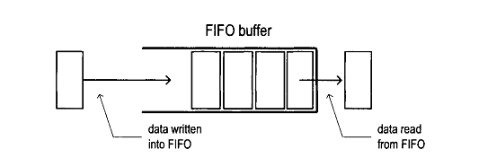
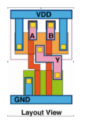
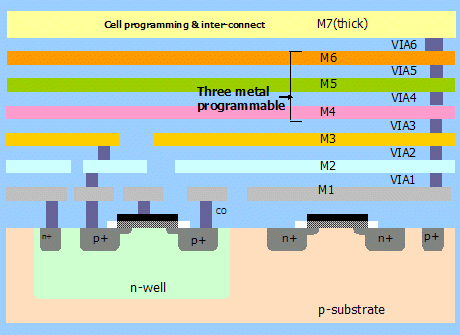
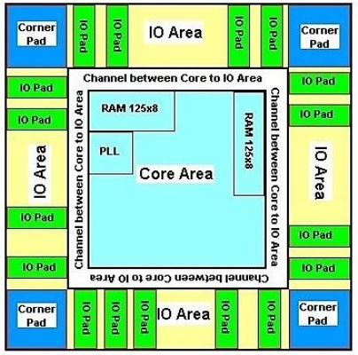
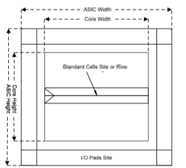
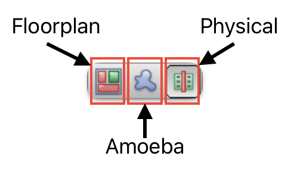
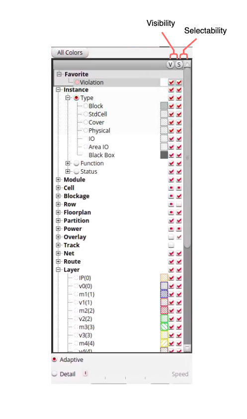

# ASIC Lab 4: Floorplanning, Placement, Power, and CTS
<p align="center">
Prof. John Wawrzynek
</p>
<p align="center">
TA: Kevin He, Kevin Anderson
</p>
<p align="center">
Department of Electrical Engineering and Computer Science
</p>
<p align="center">
College of Engineering, University of California, Berkeley
</p>


## Overview
**Setup:**
Pull lab4 from the staff skeleton:
```
cd /home/tmp/<your-eecs-username>
cd asic-labs-<github-username>
git pull skeleton main
git push -u origin main
```
Setup CAD tools environment:
```
source /home/ff/eecs151/asic/eecs151.bashrc
```
**Objective:** 
In this lab, you will be introduces to place and route. This stage is digital design following synthesis. It takes the netlist, efficiently places cells, and creates routes or connections between cells to implement your design. This lab consists of three parts:
1. For the first part, you will be writing a GCD coprocessor that could be included alongside a general-purpose CPU (like your final project)
2. You will then learn how the tools can create a floorplan, route power straps, place standard cells, perform timing optimizations, and generate a clock tree for your design (only the placement portion of place and route)
3. Finally, you will get a slight head start on your project by writing part of the ALU

This lab contains a series of conceptual questions labeled as *thought experiments.* These will not be graded and should not be included in your lab report. They are meant to deepen your understanding of the material, and serve as discussion points during your lab section.

**Topics Covered**
- Place and Route 
- Metal Layers
- Standard Cell
- CAD Tools (emphasis on *Innovus*)
- Hammer
- Skywater 130mm PDK
- Reading Reports

**Recommended Reading**
- [Verilog Primer](https://inst.eecs.berkeley.edu/~eecs151/fa21/files/verilog/Verilog_Primer_Slides.pdf)
- [Hammer-Flow](https://hammer-vlsi.readthedocs.io/en/latest/Hammer-Flow/index.html)
- [Ready-Valid Interface](https://inst.eecs.berkeley.edu/~eecs151/fa21/files/verilog/ready_valid_interface.pdf)

<span style="color:red"> ***WARNING:*** **Under no circumstance should any third party information, manuals be copied from the instructional servers to personal devices. In addition, do not copy plugins from hammer that interact with third party tools to a personal device.**</span>

<!-- ```shell
source /home/ff/eecs151/asic/eecs151.bashrc
```

```shell
cd /home/tmp/<your-eecs-username>
cd asic-labs-<github-username>
git pull skeleton main
git push -u origin main
``` -->


# Background

The sections presented here are meant to provide context that will benefit you in the lab exercise. Please review them (at minimum skim) to gain a better understanding of the what, the why, and the how of physical design for ASICs.


## FIFO

A first-in first-out (FIFO) queue is a common data structure in both hardware and software. The purpose of a FIFO is to buffer, or hold, incoming data until that data requested. Once requested, data will exit the FIFO. There are many implementations of FIFO, but they all follow a single strict ordering rule: *any particular entry must exit the FIFO prior to any entries that entered after it.* For this reason, a FIFO is often compared to a queue, or line formed as entrances (ex. a line to enter a concert or a line formed in school cafeteria for lunch). FIFOs are frequently utilized in digital design at module interfaces. 

<figure align="center">
  
  <figcaption align="center">Block diagram of a FIFO (borrowed from: http://tinyurl.com/2becpjhk).</figcaption>
</figure>


Conceptually, there are two sides to a FIFO: (1) one side receives incoming data and (2) the other side outputs outgoing data. Each "side" is a separate interface, often a simple ready-valid interface. The FIFO *width* describes the bitwidth of the data it contains. The FIFO *depth* describes the number of entries the FIFO can hold. 

It is critical understand that a FIFO is constructed from some form of memory. FIFOs are composed of etiher registers or SRAM. Although functionality is the same regardless of the underlying memory, the cost of implementation in ASIC design is different, especially for wide and/or deep FIFOs. In ASIC design, registers are consider to be more expensive as they are not as compact as SRAM. Therefore, large FIFOs are preferrablly SRAM based. 

## Standard Cell
A standard cell is predefined physical layout of transistors for logic gates and storage elements (latches or flip-flops). Standard cells have the same height, but may differ in width. The number of transistors and size of the transistors used determines the size of the standard cell. Each cell comes with timing and power information used during place and route. A cell library is the collection of standard cells used for a process, and is part of the PDK. Within the same PDK, there will be mutiple cells implementing the same logic gate, but with different sized transistors. A variety of cells  implementing the same logical function with different transistor sizes allows the CAD tool to select which variant to use in order to meet power and timing specifications (larger transistors require more power, but can drive larger currents, the trend is opposite for smaller transistors).

<figure align="center">
  
  <figcaption align="center">Layout of NAND gate standard cell.</figcaption>
</figure>


## VLSI

ASICs are 3D structures like a layer cake. At the bottom, is the substrate which is where the transistors lie. Above the substrate are alternating layers of a *metal layer *and a dieletric. The number of layer is process dependent and determined by the foundry.
Metal layers are an important concept to understand in ASIC design. Transistors are connected through metal layers. Routes must go through the dielectric up to a metal layer, route through a layer or mutiple layers, then back down the the subtrate to connect transistors. Conenctions between metal layers are called ***vias***. In addition, power rails are contained in metal layers. Typically, layers higher up contain global route, and layer closer to the substrate contained local route. Power distribution is on the higher layers, and routes between two logic gates are on hte lower layers.

<figure align="center">
  
  <figcaption align="center">Example metal layer stack up of a toy ASIC. Please ignore the "Three metal programmable" annotation in the figure. (borrowed from: http://tinyurl.com/5bjejjsz)</figcaption>
</figure>


## Place and Route
Place and route actualizes your design or circuit with physical transistors. It is part of "physical design" which is also called PD. Place and route (often written as PAR, P&R, PnR) follows directly after synthesis in digital design (both ASIC and FPGA). The netlist produced during synthesis expresses the entire design at the gate-level with cells from the provided PDK. During PAR, a physical cell instance is created for each cell in the netlist and placed in the chip area. Following placement, routes (or traces) are created to wire the cells together as specified by the netlist.


Intuitively, better placement of the cells implies more efficient routing which means less area and the better timing results. Similarly, the opposite is true; poor placement of cells requires long routes and often fails timing (placement is why synthesis timing reports are not accurate for the final circuit). The output of place and route is a layout.


PAR is the most complex and longest stage in the digital design flow. The details of PAR are beyond the level of this lab, however it is important to know the general strategy of its algorithms. The design is first partitioned into sub-designs which exploits parallelism to reduce runtime. The initial placement is iterated upon until the optimal placement is found meeting the design specifications (power, timing, and area) given user constraints. Each CAD tool has their own place and route algorithms, however they all contain similar stages:


1. *Floorplan*
2. *Clock-Tree-Synthesis*
3. *Placement and Route*

  > Note: THIS SECTION IS A SIMPLE INTRODUCTION TO PLACE AND ROUTE. PLACE AND ROUTE IS THE MOST CRITICAL STAGE IN THE ASIC DESIGN FLOW AND ALL DETAILS CAN NOT BE DISCUSSED WITHIN A SINGLE LAB.


### Floorplanning 
Floorplanning is the process of allocating area for the design, constraining how the area is utilized, and power planning. Floorplanning is often the most important factor for determining a physical circuit’s performance, because intelligent floorplanning can assist the tool in minimizing the delays in the design, especially if the total area is highly constrained.

<figure align="center">
  
  <figcaption align="center">Block diagram of floorplan showing die area(full image), IO ring, and core area (borrowed from: http://tinyurl.com/237euu99).</figcaption>
</figure>

The total area designated for the ASIC is called the ***die area*** as it is the total area for a single die. The die area is further subdivided into the IO ring and the core area. The ***IO ring***, sometimes called the IO area, lies between the border of the die area and core area, and is reserved for IO cells. IO cells contain all circuitry required to support I/O including ESD, receiver, driver and IO pads. The remaining area is termed the ***core area***. This is where your design standard cells and macros are placed. The core area is divided into rows of fixed height. Standard cells are placed within these rows. These rows have ***power stripes*** which power to the standard cells and provide structure to the layout of the design.

<figure align="center">
  
  <figcaption align="center">Die area with example rows shown (borrowed from: http://tinyurl.com/bd76apw2).</figcaption>
</figure>


Floorplan constraints can be “hard” or “soft”. “Hard” constraints generally involve pre-placement of “macros”, which can be anything from memory elements (SRAM arrays, in an upcoming lab) to analog black boxes (like PLLs or LDOs). “Soft” constraints are generally guided placements of hierarchical modules in the design (e.g. the datapath, controller, and FIFOs), towards certain regions of the floorplan. Generally, the PAR tool does a good job of placing hierarchical modules optimally, but sometimes, a little human assistance is necessary to eke out the last bit of performance.

Power planning is another major step in floorplanning. ASICs commonly have ***power straps***, route carrying power from the power rails, of different voltages stretched across the core area. The location and arrangement of the rails can be customized to support the given layout of the circuit. Power planning must be done carefully as it affects the placement of macros and standard cells. Furthermore, individual macros might have power rings, or power rails surrounding them which are independent from other logic or macros.


### Clock Tree Synthesis (CTS): Overview

Clock Tree Synthesis (CTS) is arguably the next most important step in PAR behind floorplanning. Recall that up until this point, we have not talked about the clock that triggers all the sequential logic in our design. This is because the clock signal is assumed to arrive at every sequential element in our design at the same time. The synthesis tool makes this assumption and so does the initial cell placement algorithm. In reality, the sequential elements have to be placed wherever makes the most sense (e.g. to minimize delays between them). As a result, there is a different amount of delay to every element from the top-level clock pin that must be “balanced” to maintain the timing results from synthesis. We shall now explore the steps the PAR tool takes to solve this problem and why it is called Clock Tree Synthesis.


<details>
  <summary>Pre-CTS Optimization</summary>
  
  #### Pre-CTS Optimization

  Pre-CTS optimization is the first round of Static Timing Analysis (STA) and optimization performed on the design. It has a large freedom to move the cells around to optimize your design to meet setup checks, and is performed after the initial cell placement. Hold errors are not checked during pre-CTS optimization. Because we do not have a clock tree in place yet, we do not know when the clocks will arrive to each sequential element, hence we don’t know if there are hold violations. The tool therefore assumes that every sequential element receives the clock ideally at the same time, and tries to balance out the delays in data paths to ensure no setup violations occur. In the end, it generates a timing report, very similar to the ones we saw in the last lab.

</details>


<details>
  <summary>Clock Tree Clustering and Balancing</summary>

#### Clock Tree Clustering and Balancing
Most of CTS is accomplished after initial optimization. The CTS algorithm first clusters groups of sequential elements together, mostly based on their position in the design relative to the top-level clock pin and common clock gating logic. The numbers of elements in each cluster is selected so that it does not present too large of a load to a driving cell. These clusters of sequential elements are the “leaves” of the clock tree attached to branches.

Next, the CTS algorithm tries to ensure that the delay from the top-level clock pin to the leaves are all the same. It accomplishes this by adding and sizing clock buffers between the top-level pin and the leaves. There may be multiple stages of clock buffering, depending on how physically large the design is. Each clock buffer that drives multiple loads is a branching point in the clock tree, and strings of clock buffers in a row are essentially the “trunks”. Finally, the top-level clock pin is considered the “root” of the clock tree.

The CTS algorithm may go through many iterations of clustering and balancing. It will try to minimize the depth of the tree (called *insertion delay*, i.e. the delay from the root to the leaves) while simultaneously minimizing the *skew* (difference in insertion delay) between each leaf in the tree. The deeper the tree, the harder it is to meet both setup and hold timing (*thought experiment #1*: why is this?).
</details>

<details>
  <summary>Post-CTS Optimization</summary>

#### Post-CTS Optimization
Post-CTS optimization is then performed, where the clock is now a real signal that is being distributed unequally to different parts of the design. In this step, the tool fixes setup and hold time violations simultaneously. Often times, fixing one error may introduce one or multiple errors (*thought experiment #2*: why is this?), so this process is iterative until it reaches convergence (which may or may not meet your timing constraints!). Fixing these violations involve resizing, adding/deleting, and even moving the logic and clock cells.

After this stage of optimization, the clock tree and clock routing are fixed. In the next lab, you will finish the PAR flow, which finalizes the rest of the routing, but it is usually the case that if your design is unable to meet timing after CTS, there’s no point continuing!
</details>

### Placement

Placement is the process of placing the synthesized design (structural connection of standard cells) onto the specified floorplan. While there is placement of minor cells (such as bulk connection cells, antenna-effect prevention cells, I/O buffers...) that take place separately and in between various stages of design, “placement” usually refers to the initial placement of the standard cells. After the cells are placed, they are not “locked”–they can be moved around by the tool during subsequent optimization steps. However, initial placement tries its best to place the cells optimally, obeying the floorplan constraints and using complex heuristics to minimize the parasitic delay caused by the connecting wires between cells and timing skew between synchronous elements (e.g. flip-flops, memories). Poor placement (as well as poor aspect ratio of the floorplan) can result in congestion of wires later on in the design, which may prevent successful routing.


## Innovus

In this course, we use Cadence *Innovus* to perform place and route. Innovus does have a GUI, however, like most CAD tools, it is more common to interface with *Innovus* use scripts. That said, the best method to verify good placement and visualization of errors is with the GUI. Here we give a quick tutorial to work with the GUI.

The most critical aspect of the GUI is understanding the three different views: Floorplan, Amoeba, and Physical. Each view has a different use case:

 |    View     |                                                                                                                                            Description                                                                                                                                              |
|:---------:  |-------------------------------------------------------------------------------------------------------------------------------------------------------------------------------------------------------------------------------------------------------------------------------------------------  |
| *Floorplan*   | This view is primarily used during floorplanning to assess high level characteristic. In this view, utilization of modules from the design hierarchy are shown on the left of the die area as pink rectangles where their size represents area and estimates for the utilization in each rectangle   |
|   *Amoeba*    | A view that focuses on the core area where modules of the design hierarchy are represented as pink blobs. These blobs can be selected to highlight all standard cells associated with that module. Furthermore, blobs can be further subdivided if there is a submodule hierarchy                       |
| *Physical*    | A view which represents the physical layout of individual standard cells, metal layers, power strap, blockages and more. This view provides the most information about the physical implementation of the design. In this view, individual traces between standard cells can be inspected.          |


<figure align="center">
  
  <figcaption align="center">View menu at top right of toolbar</figcaption>
</figure>


The pane on the far right allows users to customize the objects displayed in the selected view. Objects have two properties: visibility (V) and selectability (S):
- If the visibility box associated with the object is selected, then the object is visible, otherwise it is removed from the view. 
- If the selectability box associated with the object is selected, then the object is selectable with the cursor, otherwise it is not.

It is often useful to have remove the visibility and selectability of not pertinent objects when trying to investigate a particular issue. It is also useful to engage the visibility, but remove the selectable of objects which are pertinent, but should not interfere while you select objects in the view while debugging.

<figure align="center">
  
  <figcaption align="center">Innovus sidebar to customize the view</figcaption>
</figure>

Objects are categorized within the dropdowns which naturally follow the organization of physical design. Pay attention the *Layer* category. This lists the different layers of your ASIC. The abbreviation is *m* for metal layer, and *v* for vias. Metal layer and vias are only visible in the *Physical* view, however by engaging and disengaging the visibility and selectability of the layers allows you to investigate individual routes (you can even trace a route between to cell by right clicking it and selecting the appropriate option from the dropdown that appears). The final category we will discuss is *Net* which allows you to hide or show different nets by type. This is incredibly useful for analyzing the impact of global routes like clock, reset, and power straps.


The *Innvous* GUI offers many more tools which aid in physical design including: zooming, selecting regions, highlight, rulers, moving objects, manipulating route, flylines (visualize aid for showing source and destination for routes; occurs when either source or destination is selected), and more. If interested, please look at the *Innovus* User Guide for more info as this lab cannot introduce all the details.


*Innovus* is a powerful tool, but the learning curve is steep, therefore, in this class, we primarily use the GUI for visualization and interact with the tool through scripting. The flow used in this course is generated by HAMMER which abstracts a lot of the cumbersome lower level detail away, but there are principal steps of the flow which one should know (HAMMER follows a MMMC mode initialization flow):
|   Innovus Command     | Description                                                                                                                                                                                                                                                                                 |
|:-------------------:  |-------------------------------------------------------------------------------------------------------------------------------------------------------------------------------------------------------------------------------------------------------------------------------------------- |
|     _read_mmmc_       | Reads in a Multi Mode Multi corner (MMMC) file into the design. A MMMC file specifies different modes and corners which the design can operate in. This is important for static timing analysis                                                                                             |
|   _read_physical_     | Reads in any files pertaining to the physical aspects of the design (ex LEF files)                                                                                                                                                                                                          |
|    _read_netlist_     | Reads the netlist of the design into Innovus                                                                                                                                                                                                                                                |
| _read_power_intent_   | Reads in CPF file A CPF file contains information about power domains in the design (voltage, names, groups, etc)                                                                                                                                                                           |
|    _init_design_      | A view which represents the physical layout of individual standard cells, metal layers, power strap, blockages and more. This view provides the most information about the physical implementation of the design. In this view, individual traces between standard cells can be inspected.  |
| _create_floorplan_    | Create the floorplan; specifies the die are and any margins                                                                                                                                                                                                                                 |
|    _create_bump_      | Create bumps for design; bumps are location for IO to be routed to (modern IC design does not have pin for IO, but bumps)                                                                                                                                                                   |
|  _place_opt_design_   | Run placement for standard cells and optimize pre-CTS                                                                                                                                                                                                                                       |
|    _ccopt_design_     | Create CTS and performs optimizations of clock-tree to meet timing constraints                                                                                                                                                                                                              |
|    _route_design_     | Route the design                                                                                                                                                                                                                                                                            |
|     _opt_design_      | Optimize the design for better PPA; the tool is allowed the shuffle standard cells, modify routing, etc to optimize design                                                                                                                                                                   |
|    _add_fillers_      | Add fillers cells to the design; filler cells occupy spaces in the die area where standard cells are absent to provide structural integrity to the chip                                                                                      
                  

## Place and Route with HAMMER

### Placement Constraints
In this lab, we will provide basic placement constraints specified in the *design.yml* file. Navigate to the Lab 4 parent directory, Open up this file and locate the following text block:

```yaml
# Placement Constraints
vlsi.inputs.placement_constraints:
  - path: "gcd_coprocessor"
    type: "toplevel"
    x: 0
    y: 0
    width: 600
    height: 600
    margins:
      left: 10
      right: 10
      top: 10
      bottom: 10
  - path: "gcd_coprocessor/GCDdpath0"
    type: "placement"
    x: 200
    y: 200
    width: 200
    height: 200

# Pin Placement Constraints
vlsi.inputs.pin_mode: generated
vlsi.inputs.pin.generate_mode: semi_auto
vlsi.inputs.pin.assignments: [
  {pins: "*", layers: ["met2", "met4"], side: "bottom"}
]
```
<!---tech-->

The `vlsi.inputs.placement_constraints` block specifies two floorplan constraints. The first one denotes the origin `(x, y)`, size `(width, height)` and border margins of the top-level block `gcd_coprocessor`. The second one denotes a soft placement constraint on the GCD datapath to be roughly in the center of the floorplan (for complicated designs, floorplans of major modules are often defined separately, and then assembled together hierarchically). Pin constraints are also shown here. The only thing to recognize is that all pins are constrained at the bottom boundary of the design, on layers metal 2 and metal 4. <!--- tech -->
Pin placement becomes very important in a hierarchical design, if modules need to abut each other.


<!-- Now that we went over the flow (at least at a high level), it is time to actually perform these steps. Type the following commands to perform the above described operations:

```shell
make syn-to-par
make redo-par HAMMER_EXTRA_ARGS="--stop_after_step clock_tree"
```


The first command here translates the outputs of the synthesis tool to conform to the inputs expected by the PAR tool. The second command is similar to the partial synthesis commands we used in the last lab. It tells HAMMER to do the PAR flow until it finishes CTS, then stop. Under the hood, for this lab, HAMMER uses Cadence Innovus as the back-end tool to perform PAR. HAMMER waits until Innovus is done with the PAR steps through post-CTS optimization, then exits. You will see that HAMMER again gives you an error - similar to last lab when HAMMER expected a synthesized output, this time HAMMER expects the full flow to be completed and gives an error whenever it can’t find some collateral expected of PAR.

Once done, look into the `build/par-rundir` folder. Similar to how all the synthesis files were placed under `build/syn-rundir` folder in the previous lab, this folder holds all the PAR files. Go ahead and open `par.tcl` file in a text editor. HAMMER generated this file for Innovus to consume in batch mode, and inside are Innovus Common UI commands as a TCL script.

While we will be looking through some of these commands in a bit, first take a look at `timingReports`. You should only see the pre-CTS timing reports. `gcd_coprocessor_preCTS_all.tarpt.gz` contains the report in a g-zipped archive. The remaining files also contain useful information regarding capacitances, length of wires etc. You may view these directly using Vim, unzip them using `gzip`, or navigate through them with Caja, the file browser.

Going back a level, in `par-rundir`, the folder `hammer_cts_debug` has the post-CTS timing reports. The two important archives are `hammer_cts_all.tarpt.gz` and `hammer_cts_all_hold.tarpt.gz`. These contain the setup and hold timing analyses results after post-CTS optimization. Look into the hold report (you may actually see some violations!). However, any violation should be small (<1 ps) and because we have a lot of margins during design (namely the `design.yml` file has “clock uncertainty” set to 100 ps), these small violations are not of concern, but should still be investigated in a real design. -->


### Power

Power must be delivered to the cells from the topmost metal layers all the way down to the transistors, in a fashion that minimizes the overall resistance of the power wires without eating up all the resources that are needed for wiring the cells together. You will learn about power distribution briefly at the end of this course’s lectures, but the preferred method is to place interconnected grids of wide wires on every metal layer. There are tools to analyze the quality of the `power_distribution` network, which like the post-PAR simulations you did in Lab 1, calculate how the current being drawn by the circuit is transiently distributed across the power grid.


In the middle of the  `sky130.yml` file, you will see this block, which contains parameters to HAMMER’s power strap auto-calculation API:

```yaml
# Power Straps
par.power_straps_mode: generate
par.generate_power_straps_method: by_tracks
par.blockage_spacing: 2.0
par.blockage_spacing_top_layer: met3
par.generate_power_straps_options:
  by_tracks:
    strap_layers:
      - met2
      - met3
      - met4
      - met5
    blockage_spacing_met2: 4.0
    track_width: 6
    track_width_met5: 2
    track_spacing: 1
    track_start: 10
    track_start_met5: 1
    power_utilization: 0.2
    power_utilization_met2: 0.05
    power_utilization_met5: 0.5
```

You should not need to touch this block of yaml, because the parameters are tuned for meeting design rules in this technology. However, the important parameter is `power_utilization`, which specifies that approximately 20% of the available routing space on each metal layer should be reserved for power, with the exception of metals 2 and 5, which have 5% and 50% density, respectively.


# Exercises

## GCD Accelerator

### Design

We will build upon the GCD module from Lab 3 by adding FIFOs. As a reminder, the GCD module computes the greatest compute denominator between two inputs. Your module will act as an accelerator which accepts inputs from a processor and returns the result. Below is a block diagram of the general design:

<p align="center">
  
</p>


As a reminder, a FIFO is a sequential logic element which accepts (enqueues) valid data and outputs (dequeues) it in the same order when the next block is ready to accept. This is useful for buffering between the producer of data and its consumer.

A partially written FIFO has been provided for you in *fifo.v*. For this specific implementation, when the input data is valid (`enq_val`) and the FIFO is ready for data (`enq_rdy`), the input data is enqueued into the FIFO. There are similar signals for the output data. This interface is called a “decoupled” interface, and if implemented correctly it makes modular design easy (although sometimes with performance penalties).

Below is a specification for the expected FIFO implementation:
- This FIFO is implemented with a 2-dimensional array of data called `buffer`. 
- There are two pointers: a read pointer `rptr` and a write pointer `wptr`. 
- When data is enqueued, the write pointer is incremented. 
- When data is dequeued, the read pointer is incremented. 
- The FIFO depth is always a power of 2 (`LOGDEPTH` parameter)
  - we can leverage the fact that addition rolls over and the FIFO will continue to work. 
- If the read and write pointers are the same, we don’t know if the FIFO is full or empty. The `full` register clears this ambiguity. When the pointers are the same and we just enqueued the `full` register is set to 1, and set to 0 otherwise.

Please complete the FIFO implementation so that it behaves as expected.


Template code for the GCD coprocessor has been provided in the `skel/src` directory. Below are the reproduced contents of `gcd_coprocessor.v`:

```verilog
module gcd_coprocessor #( parameter W = 32 )(
  input clk,
  input reset,
  input operands_val,
  input [W-1:0] operands_bits_A,
  input [W-1:0] operands_bits_B,
  output operands_rdy,
  output result_val,
  output [W-1:0] result_bits,
  input result_rdy
);

  // You should be able to build this with only structural verilog!

  // TODO: Define wires

  // TODO: Instantiate gcd_datapath

  // TODO: Instantiate gcd_control

  // TODO: Instantiate request FIFO

  // TODO: Instantiate response FIFO

endmodule
```

This module is parameterized. `W` is the data width of your coprocessor; the input data and output data will all be this bitwidth. Be sure to pass this parameter on to any submodules that may use it! You should implement a coprocessor that can handle 4 outstanding requests at a time. For now, you will use FIFOs to store requests and responses.


Complete the coprocessor implementation in `gcd_coprocessor.v`, so that the GCD unit and FIFOs are connected like in the diagram above. Note the connection between the `gcd_datapath` and `gcd_control` should be very similar to that in Lab 3’s `gcd.v` and that clock and reset are omitted from the diagram. You will need to think about how to manage a ready/valid decoupled interface with 2 FIFOs in parallel.

### Testbench
A testbench has been prov  ided for you (`gcd_coprocessor_testbench.v`). You can run the testbench to test your code by typing `make sim-rtl` in the *skel* dirtectory as before.


### Place and route

<!-- In this lab, you will begin to implement your GCD coprocessor in physical layout–the next step towards making it a real integrated circuit. Place & Route (P&R or PAR) itself is a much longer process than synthesis, so for this lab we will look at the first few steps: floorplanning, placement, power straps, and clock tree synthesis (CTS). The rest will be introduced in the next lab. -->

<!-- #### Setting up for PAR -->

First, synthesize your design:

```shell
make syn
```

<span style="color:red"> **Before proceeding, make sure your design meets timing at the default clock period. If your design fails timing, then you need modify your design to ensure it meets timing.** </span>

Next, run the following commands to run place and route ***only until the end of CTS***:
```shell
make syn-to-par
make redo-par HAMMER_EXTRA_ARGS="--stop_after_step clock_tree"
```

The first command here translates the outputs of the synthesis tool to conform to the inputs expected by the PAR tool. The second command is similar to the partial synthesis commands we used in the last lab.  HAMMER will wait until *Innovus* is done with the PAR steps through post-CTS optimization then ends PAR.

<!-- You will see that HAMMER again gives you an error - similar to last lab when HAMMER expected a synthesized output, this time HAMMER expects the full flow to be completed and gives an error whenever it can’t find some collateral expected of PAR. -->

Once done, look into the *build/par-rundir* folder. Similar to how all the synthesis files were placed under *build/syn-rundir* folder in the previous lab, this folder holds all the PAR files. Let's look at the most important outputs from PAR:


- *par.tcl*: HAMMER generated this file for *Innovus* to consume in batch mode, and inside are Innovus Common UI commands as a TCL script. 
  
- *timingReports*: the directory containing the pre-CTS timing reports. `gcd_coprocessor_preCTS_all.tarpt.gz` contains the report in a g-zipped archive. The remaining files also contain useful information regarding capacitances, length of wires etc. You may view these directly using Vim, unzip them using `gzip`, or navigate through them with Caja, the file browser.
  
- *hammer_cts_debug*: the directory containing the post-CTS timing reports. The two important archives are `hammer_cts_all.tarpt.gz` and `hammer_cts_all_hold.tarpt.gz`. These contain the setup and hold timing analyses results after post-CTS optimization. Look into the hold report (you may actually see some violations!). However, any violation should be small (<1 ps) and because we have a lot of margins during design (namely the `design.yml` file has “clock uncertainty” set to 100 ps), these small violations are not of concern, but should still be investigated in a real design.

                           	
### Optional Exercise: Step-by-Step with Innovus
As an **optional** exercise, step through the *Innovus* using the commands from *par.tcl*. While entering the commands you will see *Innovus* print out information about the progress of each step. Make sure you are in the directory *build/par-rundir* and type:

```shell
innovus -common_ui
```
Now, follow *par.tcl* command-by-command, copying and pasting the commands to the Innovus shell and looking at the GUI for any changes. You may skip the `puts` commands as they just tell the tool to print out what its doing, and the `write_db` commands which write a checkpoint database between each step of the PAR flow. The steps that you will see significant changes are listed below. As you progress through the steps, feel free to zoom in to investigate what is going on with the design, look at the extra TCL files that are sourced, and cross-reference the commands with the command reference manual at `/home/ff/eecs151/labs/manuals/TCRcom.pdf`.

1. After the command sourcing `floorplan.tcl`
2. After the command sourcing `power_straps.tcl`
3. After the command `edit pin`
4. After the command `place_opt_design`

After the `ccopt_design` command is run, you may see a bunch of white X markers on your design. These are some Design Rule Violations (DRVs), indicating Innovus didn’t quite comply with the technology’s requirements. Ignore these for the purposes of this lab.


## Visualizing the Results

From the `build/par-rundir` folder, execute the following in a terminal with graphics (X2Go highly recommended for low latency):

```shell
./generated-scripts/open_chip
```
The Innovus GUI should pop up with your layout, and the *Innovus* shell runs in your terminal. After the window opens, click anywhere inside the black window at the center of the GUI and press “F” to zoom-to-fit. You should see your entire design, which should look roughly similar to the one below once you disable the V5 and M5 layers using the right panel by unchecking their respective boxes under the "V" column:

> ### Checkoff 1: Innovus 
> Demonstrate that you are able to succesfully PAR your design by showing a TA the layout in Innovus. Also, show the TA a specific standard cell and identify what type of cell it is.
>
> &nbsp;

<p align="center">

</p>

### Familiarize Yourself with the Innovus GUI
Take a moment to familiarize yourself with the Innovus GUI. You should also toggle between the floorplan, amoeba, and placement views using the buttons that look like this:   and examine how the actual placement of the GCD datapath in ameoba view doesn’t follow our soft placement guidance in floorplan view. This is because our soft placement guidance clearly places the datapath farther away from the pins and would result in a worse clock tree!

Now, let’s take a look at the clock tree a couple different ways. In the right panel, under the “Net” category, hide from view all the types of nets except “Clock”. Your design should now look approximately like this, which shows the clock tree routing:

<p align="center">

</p>


We can also see the clock tree in its “tree” form by going to the menu Clock → CCOpt Clock Tree Debugger and pressing OK in the popup dialog. A window should pop up looking approximately like this:

<p align="center">

</p>


The red dots are the “leaves”, the green triangles are the clock buffers, the blue dots are clock gates (they are used to save power), and the green pin on top is the clock pin or the clock “root”. The numbers on the left side denote the insertion delay in ps.

Now, let’s visualize our critical path. Go to the menu Timing → Debug Timing and press OK in the popup dialog. A window will pop up that looks approximately like this:

<p align="center">

</p>

Examine the histogram. This shows the number of paths for every amount of slack (on the x-axis), and you always want to see a green histogram! The shape of the histogram is a good indicator of how good your design is and how hard the tool is working to meet your timing constraints (*thought experiment #3:* how so, and what would be the the ideal histogram shape?).

Now right-click on Path 1 in this window (the critical path), select Show Timing Analyzer and Highlight Path, and select a color. A window will pop up, which is a graphical representation of the timing reports you saw in the hammer cts debug folder. Poke around the tabs to see all the different representations of this critical path. Back in the main Innovus window, the critical path will be highlighted, showing the chain of cells along the path and the approximate routing it takes to get there, which may look something like this:

<p align="center">

</p>


When you are done, you may exit Innovus by closing the GUI window.


Now zoom in to one of the cells and click the box next to “Cell” on the right panel of the GUI. This will show you the internal routing of the standard cells. While by default we have this off, it may prove useful when investigating DRVs in a design. You can now exit the application by closing the GUI window.

## ALU
In this section, you will be designing and testing an ALU for later use in the semester. A header file containing define statements for operations (`ALUop.vh`) is provided inside the *src* directory of this lab. This file has already been included in an ALU template given to you in the same folder (`ALU.v`), but you may need to modify the include statement to match the correct path of the header file. Compare `ALUop` input of your ALU to the define statements inside the header file to select the function ALU is currently running. For `ADD` and `SUB`, treat the operands as unsigned integers and ignore overflow in the result. Definition of the functions is given below:
  
| Op Code |                         Definition                        |
|:-------:|:---------------------------------------------------------:|
|   ADD   |                         Add A and B                       |
|   SUB   |                      Subtract B from A                    |
|   AND   |                    Bitwise `and` A and B                  |
|    OR   |                     Bitwise `or` A and B                  |
|   XOR   |                    Bitwise `xor` A and B                  |
|   SLT   |        Perform a signed comparison, Out=1 if  A < B       |
|   SLTU  |      Perform an unsigned comparison, Out = 1 if A < B     |
|   SLL   |   Logical shift left A by an amount indicated by B[4:0]   |
|   SRA   | Arithmetic shift right A by an amount indicated by B[4:0] |
|   SRL   |   Logical shift right A by an amount indicated by B[4:0]  |
|  COPY_B |                    Output is equal to B                   |
|   XXX   |                        Output is 0                        |

Given these definitions, complete `ALU.v` and write a testbench tb `ALU.v` that checks all these operations with random inputs at least a 100 times per operation and outputs a PASS/FAIL indicator. For this lab, we will only check for effort and not correctness, but you will need it to work later!

> ### Checkoff 2: ALU
> Demonstrate the functionality of your ALU and testbench to the TA.
>
> &nbsp;

To make the Verilog `include` statements work correctly, add this to the list of VCS options in your sim-rtl YML:
```
options:
- "+incdir+../../src"
```

---


# Questions

### Question 1: Design
<ol type="a">
<li> Submit your code (`gcd_coprocessor.v` and `fifo.v`) and show that your code works (VCS output is fine)</li>
</ol>

### Question 2: Interpreting PAR Timing Reports
<ol type="a">
<li>What is the critical path of your design pre- and post-CTS? Is it the same as the post-synthesis critical path?</li>

<li> Look in the post-CTS text timing report (`hammer_cts_debug/hammer_cts.all.tarpt`). Find a path inside which the same type of cell is used more than once. Identify the delay of those instances of that common cell. Can you explain why they are different?</li>

<li>  What is the skew between the clock that arrives at the flip-flops at the beginning and end of the post-CTS critical path? Does this skew help or hurt the timing margin calculation?</li>
</ol>


Thought Experiements (UNGRADED):
<ol type="a">
  <li>Why is it harder to meet both setup and hold timing constraints if the clock tree has large insertion delay?</li>

  <li> Why does fixing one setup or hold error introduce one or multiple errors? Is it more likely to produce an error of the same, or different type, and why?</li>

  <li>PAR tools have a goal to minimize power while ensuring that all paths have have >0ps of slack. What might a timing path histogram look like in a design that has maximized the frequency it can run at while meeting this goal? Given the histogram obtained here, does it look we can increase our performance? What might we need to improve/change?</li>
</ol>

### Question 3: Understanding PAR Steps
<ol type="a">
<li> Examine the power straps on M1, in relation to the cells. You will need to zoom in far enough to see the net label on the straps. What does their pattern tell you about how digital standard cells are constructed?</li>

<li> Take a note of the orientations of power straps and routing metals. If you were to place pins on the right side of this block instead of the bottom, what metal layers could they be on?</li>
</ol>

### Question 4: ALU
<ol type="a">
<li> Submit the code for both your ALU module as well as for the testbench. 
To make the Verilog `include` statements work correctly, add this to the list of VCS options in your sim-rtl YML:<code>
options: <br>
&nbsp;  - "+incdir+../../src"
</code>
</li>
</ol>

## Lab Deliverables

### Lab Due: 11:59 PM, 1 week after your lab section.

- Submit your answers electronically to Gradescope
- Submit your code by pushing to your GitHub repository
- Checkoff with an ASIC lab TA

## Acknowledgement

This lab is the result of the work of many EECS151/251 GSIs over the years including:
Written By:
- Nathan Narevsky (2014, 2017)
- Brian Zimmer (2014)

Modified By:
- John Wright (2015,2016)
- Ali Moin (2018)
- Arya Reais-Parsi (2019)
- Cem Yalcin (2019)
- Tan Nguyen (2020)
- Harrison Liew (2020)
- Sean Huang (2021)
- Daniel Grubb, Nayiri Krzysztofowicz, Zhaokai Liu (2021)
- Dima Nikiforov (2022)
- Roger Hsiao, Hansung Kim (2022)
- Chengyi Lux Zhang, (2023)
- Kevin Anderson, Kevin He (Sp2024)
